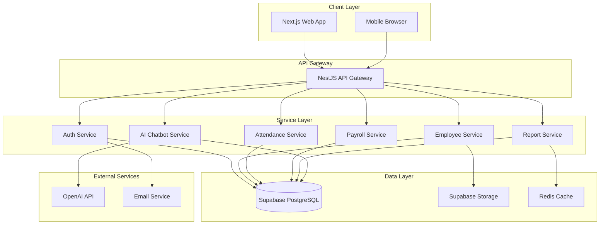

# Design Document - Hệ Thống Quản Lý Nhân Sự

## Overview

Hệ thống quản lý nhân sự được thiết kế theo kiến trúc microservices với frontend và backend tách biệt, sử dụng các công nghệ hiện đại và design patterns chuẩn mực. Hệ thống đảm bảo tính mở rộng, bảo mật, và hiệu năng cao.

**Tech Stack:**
- **Frontend**: Next.js 14+ (App Router), React 18+, TypeScript, TailwindCSS, Shadcn/ui
- **Backend**: NestJS, TypeScript, Prisma ORM
- **Database**: Supabase (PostgreSQL)
- **Authentication**: Supabase Auth + JWT
- **AI Chatbot**: OpenAI API / Anthropic Claude API
- **Real-time**: Supabase Realtime
- **File Storage**: Supabase Storage
- **Deployment**: Vercel (Frontend), Railway/Render (Backend)

## Architecture

### High-Level Architecture



### Design Patterns

**Backend (NestJS):**
1. **Module Pattern**: Tổ chức code theo modules (Employee, Attendance, Payroll, etc.)
2. **Repository Pattern**: Tách biệt logic truy cập database
3. **Service Layer Pattern**: Business logic tập trung trong services
4. **DTO Pattern**: Data Transfer Objects cho validation và type safety
5. **Dependency Injection**: NestJS built-in DI container
6. **Guard Pattern**: Authentication và Authorization guards
7. **Interceptor Pattern**: Logging, transformation, caching
8. **Strategy Pattern**: Tính lương theo các chiến lược khác nhau
9. **Factory Pattern**: Tạo các loại hợp đồng, báo cáo

**Frontend (Next.js):**
1. **Component Pattern**: Reusable React components
2. **Container/Presenter Pattern**: Tách logic và UI
3. **Custom Hooks Pattern**: Tái sử dụng logic
4. **Context Pattern**: State management (Auth, Theme)
5. **Server Components**: Next.js 14 App Router
6. **Optimistic UI Pattern**: Cập nhật UI trước khi API response

## Components and Interfaces

### Backend Modules

#### 1. Auth Module

```typescript
// auth.service.ts
interface IAuthService {
  signUp(dto: SignUpDto): Promise<AuthResponse>;
  signIn(dto: SignInDto): Promise<AuthResponse>;
  signOut(userId: string): Promise<void>;
  refreshToken(refreshToken: string): Promise<TokenResponse>;
  resetPassword(email: string): Promise<void>;
  changePassword(userId: string, dto: ChangePasswordDto): Promise<void>;
  validateToken(token: string): Promise<TokenPayload>;
}

// DTOs
interface SignUpDto {
  email: string;
  password: string;
  fullName: string;
  role: UserRole;
}

interface SignInDto {
  email: string;
  password: string;
}

interface AuthResponse {
  user: User;
  accessToken: string;
  refreshToken: string;
}

enum UserRole {
  ADMIN = 'ADMIN',
  HR_MANAGER = 'HR_MANAGER',
  MANAGER = 'MANAGER',
  EMPLOYEE = 'EMPLOYEE'
}
```

#### 2. Employee Module

```typescript
// employee.service.ts
interface IEmployeeService {
  create(dto: CreateEmployeeDto): Promise<Employee>;
  findAll(filters: EmployeeFilters): Promise<PaginatedResponse<Employee>>;
  findOne(id: string): Promise<Employee>;
  update(id: string, dto: UpdateEmployeeDto): Promise<Employee>;
  delete(id: string): Promise<void>;
  uploadAvatar(id: string, file: File): Promise<string>;
  getHistory(id: string): Promise<EmployeeHistory[]>;
  generateEmployeeCode(): Promise<string>;
}

// DTOs
interface CreateEmployeeDto {
  fullName: string;
  dateOfBirth: Date;
  gender: Gender;
  idCard: string;
  address: string;
  phone: string;
  email: string;
  departmentId: string;
  position: string;
  startDate: Date;
  baseSalary: number;
}

interface EmployeeFilters {
  search?: string;
  departmentId?: string;
  position?: string;
  status?: EmployeeStatus;
  page: number;
  limit: number;
}

enum EmployeeStatus {
  ACTIVE = 'ACTIVE',
  INACTIVE = 'INACTIVE',
  ON_LEAVE = 'ON_LEAVE'
}
```

#### 3. Department Module

```typescript
// department.service.ts
interface IDepartmentService {
  create(dto: CreateDepartmentDto): Promise<Department>;
  findAll(): Promise<Department[]>;
  findOne(id: string): Promise<Department>;
  update(id: string, dto: UpdateDepartmentDto): Promise<Department>;
  delete(id: string): Promise<void>;
  getOrganizationChart(): Promise<OrganizationChart>;
  assignManager(departmentId: string, managerId: string): Promise<void>;
}

interface CreateDepartmentDto {
  name: string;
  code: string;
  description?: string;
  parentId?: string;
  managerId?: string;
}
```

#### 4. Attendance Module

```typescript
// attendance.service.ts
interface IAttendanceService {
  checkIn(employeeId: string): Promise<Attendance>;
  checkOut(employeeId: string): Promise<Attendance>;
  requestLeave(dto: LeaveRequestDto): Promise<LeaveRequest>;
  approveLeave(requestId: string, approverId: string): Promise<LeaveRequest>;
  rejectLeave(requestId: string, approverId: string, reason: string): Promise<LeaveRequest>;
  getMonthlyReport(employeeId: string, month: number, year: number): Promise<AttendanceReport>;
  getAttendanceHistory(employeeId: string, filters: DateRangeFilter): Promise<Attendance[]>;
}

interface LeaveRequestDto {
  employeeId: string;
  startDate: Date;
  endDate: Date;
  leaveType: LeaveType;
  reason: string;
}

enum LeaveType {
  ANNUAL = 'ANNUAL',
  SICK = 'SICK',
  UNPAID = 'UNPAID',
  MATERNITY = 'MATERNITY'
}

interface AttendanceReport {
  employeeId: string;
  month: number;
  year: number;
  totalWorkDays: number;
  totalLeaveDays: number;
  lateCount: number;
  earlyLeaveCount: number;
  totalWorkHours: number;
}
```

#### 5. Payroll Module

```typescript
// payroll.service.ts
interface IPayrollService {
  calculateSalary(employeeId: string, month: number, year: number): Promise<SalaryCalculation>;
  createPayroll(month: number, year: number): Promise<Payroll>;
  getPayrollById(id: string): Promise<Payroll>;
  updatePayrollItem(itemId: string, dto: UpdatePayrollItemDto): Promise<PayrollItem>;
  finalizePayroll(payrollId: string): Promise<Payroll>;
  getPayslip(employeeId: string, month: number, year: number): Promise<Payslip>;
  exportPayroll(payrollId: string, format: ExportFormat): Promise<Buffer>;
}

interface SalaryCalculation {
  baseSalary: number;
  workDays: number;
  actualWorkDays: number;
  allowances: Allowance[];
  rewards: number;
  disciplines: number;
  overtimeHours: number;
  overtimePay: number;
  socialInsurance: number;
  healthInsurance: number;
  taxableIncome: number;
  personalIncomeTax: number;
  netSalary: number;
}

interface Allowance {
  type: AllowanceType;
  amount: number;
}

enum AllowanceType {
  TRANSPORTATION = 'TRANSPORTATION',
  MEAL = 'MEAL',
  HOUSING = 'HOUSING',
  PHONE = 'PHONE'
}
```

#### 6. Contract Module

```typescript
// contract.service.ts
interface IContractService {
  create(dto: CreateContractDto): Promise<Contract>;
  findAll(filters: ContractFilters): Promise<Contract[]>;
  findOne(id: string): Promise<Contract>;
  update(id: string, dto: UpdateContractDto): Promise<Contract>;
  renew(id: string, dto: RenewContractDto): Promise<Contract>;
  terminate(id: string, reason: string): Promise<Contract>;
  getExpiringContracts(days: number): Promise<Contract[]>;
  uploadContractFile(id: string, file: File): Promise<string>;
}

interface CreateContractDto {
  employeeId: string;
  contractType: ContractType;
  startDate: Date;
  endDate?: Date;
  salary: number;
  terms: string;
}

enum ContractType {
  PROBATION = 'PROBATION',
  FIXED_TERM = 'FIXED_TERM',
  INDEFINITE = 'INDEFINITE'
}
```

#### 7. Reward & Discipline Module

```typescript
// reward-discipline.service.ts
interface IRewardDisciplineService {
  createReward(dto: CreateRewardDto): Promise<Reward>;
  createDiscipline(dto: CreateDisciplineDto): Promise<Discipline>;
  getEmployeeRewards(employeeId: string): Promise<Reward[]>;
  getEmployeeDisciplines(employeeId: string): Promise<Discipline[]>;
  deleteReward(id: string): Promise<void>;
  deleteDiscipline(id: string): Promise<void>;
}

interface CreateRewardDto {
  employeeId: string;
  reason: string;
  amount: number;
  rewardDate: Date;
  createdBy: string;
}

interface CreateDisciplineDto {
  employeeId: string;
  reason: string;
  disciplineType: DisciplineType;
  amount: number;
  disciplineDate: Date;
  createdBy: string;
}

enum DisciplineType {
  WARNING = 'WARNING',
  FINE = 'FINE',
  SUSPENSION = 'SUSPENSION'
}
```

#### 8. Report Module

```typescript
// report.service.ts
interface IReportService {
  getEmployeeOverview(): Promise<EmployeeOverviewReport>;
  getAttendanceReport(month: number, year: number): Promise<AttendanceReportData>;
  getPayrollReport(month: number, year: number): Promise<PayrollReportData>;
  getDepartmentReport(): Promise<DepartmentReportData>;
  getContractExpiryReport(): Promise<ContractExpiryData>;
  exportReport(reportType: ReportType, filters: ReportFilters, format: ExportFormat): Promise<Buffer>;
}

interface EmployeeOverviewReport {
  totalEmployees: number;
  activeEmployees: number;
  inactiveEmployees: number;
  byDepartment: DepartmentStats[];
  byGender: GenderStats;
  byAgeGroup: AgeGroupStats[];
}

enum ReportType {
  EMPLOYEE_OVERVIEW = 'EMPLOYEE_OVERVIEW',
  ATTENDANCE = 'ATTENDANCE',
  PAYROLL = 'PAYROLL',
  DEPARTMENT = 'DEPARTMENT',
  CONTRACT_EXPIRY = 'CONTRACT_EXPIRY'
}

enum ExportFormat {
  EXCEL = 'EXCEL',
  PDF = 'PDF',
  CSV = 'CSV'
}
```

#### 9. AI Chatbot Module

```typescript
// chatbot.service.ts
interface IChatbotService {
  sendMessage(userId: string, message: string, context: ChatContext): Promise<ChatResponse>;
  getChatHistory(userId: string, limit: number): Promise<ChatMessage[]>;
  clearChatHistory(userId: string): Promise<void>;
  executeCommand(userId: string, command: string): Promise<CommandResult>;
  getSuggestedQuestions(userId: string): Promise<string[]>;
}

interface ChatContext {
  conversationId: string;
  userRole: UserRole;
  employeeId?: string;
}

interface ChatResponse {
  message: string;
  data?: any;
  suggestedActions?: SuggestedAction[];
  requiresConfirmation?: boolean;
}

interface SuggestedAction {
  label: string;
  command: string;
  description: string;
}

// AI Chatbot Strategy Pattern
interface IChatbotStrategy {
  canHandle(message: string): boolean;
  handle(userId: string, message: string, context: ChatContext): Promise<ChatResponse>;
}

class PolicyQuestionStrategy implements IChatbotStrategy {
  // Trả lời câu hỏi về chính sách công ty
}

class DataQueryStrategy implements IChatbotStrategy {
  // Truy vấn dữ liệu cá nhân (lương, nghỉ phép, chấm công)
}

class CommandExecutionStrategy implements IChatbotStrategy {
  // Thực thi lệnh (đăng ký nghỉ phép, xem bảng lương)
}

class GeneralQuestionStrategy implements IChatbotStrategy {
  // Câu hỏi chung, chuyển hướng
}
```

### Frontend Components

#### Core Components Structure

```
src/
├── app/
│   ├── (auth)/
│   │   ├── login/
│   │   └── register/
│   ├── (dashboard)/
│   │   ├── layout.tsx
│   │   ├── page.tsx (Dashboard)
│   │   ├── employees/
│   │   ├── departments/
│   │   ├── attendance/
│   │   ├── payroll/
│   │   ├── contracts/
│   │   ├── reports/
│   │   └── settings/
│   └── api/ (API routes if needed)
├── components/
│   ├── ui/ (Shadcn components)
│   ├── layout/
│   │   ├── Sidebar.tsx
│   │   ├── Header.tsx
│   │   └── Footer.tsx
│   ├── employees/
│   │   ├── EmployeeList.tsx
│   │   ├── EmployeeForm.tsx
│   │   ├── EmployeeCard.tsx
│   │   └── EmployeeDetail.tsx
│   ├── attendance/
│   │   ├── AttendanceCalendar.tsx
│   │   ├── CheckInButton.tsx
│   │   └── LeaveRequestForm.tsx
│   ├── payroll/
│   │   ├── PayrollTable.tsx
│   │   ├── PayslipViewer.tsx
│   │   └── SalaryCalculator.tsx
│   ├── reports/
│   │   ├── ChartCard.tsx
│   │   ├── EmployeeChart.tsx
│   │   └── ReportFilters.tsx
│   └── chatbot/
│       ├── ChatWidget.tsx
│       ├── ChatMessage.tsx
│       ├── ChatInput.tsx
│       └── SuggestedActions.tsx
├── lib/
│   ├── api/ (API client)
│   ├── hooks/ (Custom hooks)
│   ├── utils/ (Utilities)
│   └── validations/ (Zod schemas)
├── contexts/
│   ├── AuthContext.tsx
│   ├── ThemeContext.tsx
│   └── ChatbotContext.tsx
└── types/
    └── index.ts (TypeScript types)
```

#### Key Frontend Components

```typescript
// components/chatbot/ChatWidget.tsx
interface ChatWidgetProps {
  position?: 'bottom-right' | 'bottom-left';
  theme?: 'light' | 'dark';
}

export function ChatWidget({ position = 'bottom-right', theme }: ChatWidgetProps) {
  // Chatbot widget với minimize/maximize
  // Real-time messaging
  // Suggested actions
  // Command execution
}

// components/employees/EmployeeList.tsx
interface EmployeeListProps {
  filters: EmployeeFilters;
  onEmployeeClick: (employee: Employee) => void;
}

export function EmployeeList({ filters, onEmployeeClick }: EmployeeListProps) {
  // Server-side pagination
  // Search and filters
  // Sorting
  // Bulk actions
}

// components/reports/EmployeeChart.tsx
interface EmployeeChartProps {
  data: EmployeeOverviewReport;
  chartType: 'bar' | 'pie' | 'line';
}

export function EmployeeChart({ data, chartType }: EmployeeChartProps) {
  // Recharts integration
  // Interactive charts
  // Export functionality
}
```

## Data Models

### Database Schema (Prisma)

```prisma
// schema.prisma

model User {
  id            String   @id @default(uuid())
  email         String   @unique
  passwordHash  String
  role          UserRole
  employeeId    String?  @unique
  employee      Employee? @relation(fields: [employeeId], references: [id])
  createdAt     DateTime @default(now())
  updatedAt     DateTime @updatedAt
  
  @@map("users")
}

model Employee {
  id              String          @id @default(uuid())
  employeeCode    String          @unique
  fullName        String
  dateOfBirth     DateTime
  gender          Gender
  idCard          String          @unique
  address         String
  phone           String
  email           String          @unique
  avatarUrl       String?
  departmentId    String
  department      Department      @relation(fields: [departmentId], references: [id])
  position        String
  startDate       DateTime
  endDate         DateTime?
  status          EmployeeStatus  @default(ACTIVE)
  baseSalary      Decimal
  
  user            User?
  contracts       Contract[]
  attendances     Attendance[]
  payrollItems    PayrollItem[]
  rewards         Reward[]
  disciplines     Discipline[]
  leaveRequests   LeaveRequest[]
  history         EmployeeHistory[]
  
  createdAt       DateTime        @default(now())
  updatedAt       DateTime        @updatedAt
  
  @@map("employees")
}

model Department {
  id          String       @id @default(uuid())
  code        String       @unique
  name        String
  description String?
  parentId    String?
  parent      Department?  @relation("DepartmentHierarchy", fields: [parentId], references: [id])
  children    Department[] @relation("DepartmentHierarchy")
  managerId   String?
  
  employees   Employee[]
  
  createdAt   DateTime     @default(now())
  updatedAt   DateTime     @updatedAt
  
  @@map("departments")
}

model Attendance {
  id            String    @id @default(uuid())
  employeeId    String
  employee      Employee  @relation(fields: [employeeId], references: [id])
  date          DateTime
  checkIn       DateTime?
  checkOut      DateTime?
  workHours     Decimal?
  isLate        Boolean   @default(false)
  isEarlyLeave  Boolean   @default(false)
  status        AttendanceStatus
  notes         String?
  
  createdAt     DateTime  @default(now())
  updatedAt     DateTime  @updatedAt
  
  @@unique([employeeId, date])
  @@map("attendances")
}

model LeaveRequest {
  id          String            @id @default(uuid())
  employeeId  String
  employee    Employee          @relation(fields: [employeeId], references: [id])
  startDate   DateTime
  endDate     DateTime
  leaveType   LeaveType
  reason      String
  status      LeaveRequestStatus @default(PENDING)
  approverId  String?
  approvedAt  DateTime?
  rejectedReason String?
  
  createdAt   DateTime          @default(now())
  updatedAt   DateTime          @updatedAt
  
  @@map("leave_requests")
}

model Contract {
  id            String        @id @default(uuid())
  employeeId    String
  employee      Employee      @relation(fields: [employeeId], references: [id])
  contractType  ContractType
  startDate     DateTime
  endDate       DateTime?
  salary        Decimal
  terms         String
  fileUrl       String?
  status        ContractStatus @default(ACTIVE)
  
  createdAt     DateTime      @default(now())
  updatedAt     DateTime      @updatedAt
  
  @@map("contracts")
}

model Payroll {
  id          String        @id @default(uuid())
  month       Int
  year        Int
  status      PayrollStatus @default(DRAFT)
  totalAmount Decimal
  finalizedAt DateTime?
  finalizedBy String?
  
  items       PayrollItem[]
  
  createdAt   DateTime      @default(now())
  updatedAt   DateTime      @updatedAt
  
  @@unique([month, year])
  @@map("payrolls")
}

model PayrollItem {
  id                  String    @id @default(uuid())
  payrollId           String
  payroll             Payroll   @relation(fields: [payrollId], references: [id])
  employeeId          String
  employee            Employee  @relation(fields: [employeeId], references: [id])
  baseSalary          Decimal
  workDays            Int
  actualWorkDays      Int
  allowances          Json      // Array of allowances
  rewards             Decimal   @default(0)
  disciplines         Decimal   @default(0)
  overtimeHours       Decimal   @default(0)
  overtimePay         Decimal   @default(0)
  socialInsurance     Decimal
  healthInsurance     Decimal
  taxableIncome       Decimal
  personalIncomeTax   Decimal
  netSalary           Decimal
  
  createdAt           DateTime  @default(now())
  updatedAt           DateTime  @updatedAt
  
  @@unique([payrollId, employeeId])
  @@map("payroll_items")
}

model Reward {
  id          String    @id @default(uuid())
  employeeId  String
  employee    Employee  @relation(fields: [employeeId], references: [id])
  reason      String
  amount      Decimal
  rewardDate  DateTime
  createdBy   String
  
  createdAt   DateTime  @default(now())
  updatedAt   DateTime  @updatedAt
  
  @@map("rewards")
}

model Discipline {
  id              String          @id @default(uuid())
  employeeId      String
  employee        Employee        @relation(fields: [employeeId], references: [id])
  reason          String
  disciplineType  DisciplineType
  amount          Decimal
  disciplineDate  DateTime
  createdBy       String
  
  createdAt       DateTime        @default(now())
  updatedAt       DateTime        @updatedAt
  
  @@map("disciplines")
}

model EmployeeHistory {
  id          String    @id @default(uuid())
  employeeId  String
  employee    Employee  @relation(fields: [employeeId], references: [id])
  field       String
  oldValue    String?
  newValue    String?
  changedBy   String
  changedAt   DateTime  @default(now())
  
  @@map("employee_history")
}

model ChatMessage {
  id              String    @id @default(uuid())
  conversationId  String
  userId          String
  message         String
  response        String?
  context         Json?
  
  createdAt       DateTime  @default(now())
  
  @@index([conversationId])
  @@index([userId])
  @@map("chat_messages")
}

// Enums
enum UserRole {
  ADMIN
  HR_MANAGER
  MANAGER
  EMPLOYEE
}

enum Gender {
  MALE
  FEMALE
  OTHER
}

enum EmployeeStatus {
  ACTIVE
  INACTIVE
  ON_LEAVE
}

enum AttendanceStatus {
  PRESENT
  ABSENT
  LEAVE
  HOLIDAY
}

enum LeaveType {
  ANNUAL
  SICK
  UNPAID
  MATERNITY
}

enum LeaveRequestStatus {
  PENDING
  APPROVED
  REJECTED
}

enum ContractType {
  PROBATION
  FIXED_TERM
  INDEFINITE
}

enum ContractStatus {
  ACTIVE
  EXPIRED
  TERMINATED
}

enum PayrollStatus {
  DRAFT
  FINALIZED
}

enum DisciplineType {
  WARNING
  FINE
  SUSPENSION
}
```

## Correctness Properties

*Correctness properties là các đặc tính hoặc hành vi phải đúng trong mọi trường hợp thực thi của hệ thống. Đây là cầu nối giữa đặc tả có thể đọc được bởi con người và các đảm bảo tính đúng đắn có thể kiểm chứng bằng máy.*

### Property 1: Employee Code Uniqueness
*For any* set of employees created in the system, all employee codes must be unique across the entire database.
**Validates: Requirements 1.3**

### Property 2: Audit Trail Completeness
*For any* update operation on employee data, there must exist a corresponding history record with the old value, new value, timestamp, and user who made the change.
**Validates: Requirements 1.4**

### Property 3: Search Result Accuracy
*For any* employee search query with specific criteria (name, code, department, position), all returned employees must match at least one of the search criteria, and all employees matching the criteria must be included in results.
**Validates: Requirements 1.5**

### Property 4: File Upload Round-Trip
*For any* file uploaded to the system, downloading the file must return content identical to the original upload.
**Validates: Requirements 1.6**

### Property 5: Employee Status Transition
*For any* employee marked as terminated, the employee status must be INACTIVE and the end date must be set.
**Validates: Requirements 1.7**

### Property 6: Department CRUD Consistency
*For any* department created, the department must be retrievable by its ID, and updates must be reflected in subsequent queries.
**Validates: Requirements 2.1**

### Property 7: Employee-Department Consistency
*For any* employee assigned to a department, the employee's departmentId must match an existing department's ID.
**Validates: Requirements 2.3**

### Property 8: Department Referential Integrity
*For any* department with assigned employees, deletion attempts must fail until all employees are reassigned to other departments.
**Validates: Requirements 2.5**

### Property 9: Manager Assignment Validity
*For any* manager assigned to a department, the manager must be an existing active employee in the system.
**Validates: Requirements 2.6**

### Property 10: Check-In Recording
*For any* employee check-in action, an attendance record must be created with the current timestamp as checkIn time.
**Validates: Requirements 3.1**

### Property 11: Check-Out Recording
*For any* employee check-out action on a day with existing check-in, the attendance record must be updated with checkOut timestamp.
**Validates: Requirements 3.2**

### Property 12: Work Hours Calculation
*For any* attendance record with both checkIn and checkOut times, workHours must equal (checkOut - checkIn) in hours.
**Validates: Requirements 3.3**

### Property 13: Late Arrival Detection
*For any* check-in time after the designated start time, the attendance record must have isLate = true.
**Validates: Requirements 3.4**

### Property 14: Early Leave Detection
*For any* check-out time before the designated end time, the attendance record must have isEarlyLeave = true.
**Validates: Requirements 3.5**

### Property 15: Leave Request Notification
*For any* leave request created by an employee, a notification must be sent to the employee's department manager.
**Validates: Requirements 3.7**

### Property 16: Leave Approval State Transition
*For any* leave request approved by a manager, the status must change from PENDING to APPROVED and approvedAt timestamp must be set.
**Validates: Requirements 3.8**

### Property 17: Monthly Attendance Report Accuracy
*For any* monthly attendance report, the total work days must equal the count of attendance records with status PRESENT for that employee in that month.
**Validates: Requirements 3.9**

### Property 18: Salary Calculation Correctness
*For any* payroll calculation, netSalary must equal (baseSalary * actualWorkDays/workDays + allowances + rewards - disciplines + overtimePay - socialInsurance - healthInsurance - personalIncomeTax).
**Validates: Requirements 4.2**

### Property 19: Insurance and Tax Deduction
*For any* payroll item, socialInsurance, healthInsurance, and personalIncomeTax must be calculated according to legal rates and deducted from gross salary.
**Validates: Requirements 4.3**

### Property 20: Overtime Pay Calculation
*For any* overtime hours worked, overtimePay must equal overtimeHours * (baseSalary/standardHours) * coefficient, where coefficient is 150%, 200%, or 300% based on overtime type.
**Validates: Requirements 4.4**

### Property 21: Payroll Batch Completeness
*For any* payroll created for a specific month, there must exist a payroll item for every active employee in that month.
**Validates: Requirements 4.5**

### Property 22: Payroll Immutability After Finalization
*For any* payroll with status FINALIZED, all update operations on payroll items must be rejected.
**Validates: Requirements 4.7**

### Property 23: Payslip Data Completeness
*For any* payslip generated, it must contain all salary components: baseSalary, allowances, rewards, disciplines, overtimePay, deductions, and netSalary.
**Validates: Requirements 4.8**

### Property 24: Contract Expiry Notification
*For any* contract with endDate within 30 days from current date, a notification must be sent to HR managers.
**Validates: Requirements 5.3**

### Property 25: Contract History Preservation
*For any* employee, all contracts (past and present) must be retrievable and ordered by startDate.
**Validates: Requirements 5.5**

### Property 26: Reward and Discipline Notification
*For any* reward or discipline record created, a notification must be sent to the affected employee.
**Validates: Requirements 6.3**

### Property 27: Reward and Discipline Persistence
*For any* reward or discipline created, the record must be retrievable and associated with the correct employee.
**Validates: Requirements 6.4**

### Property 28: Payroll Integration of Rewards and Disciplines
*For any* payroll calculation, the rewards and disciplines amounts must be included in the salary calculation for the corresponding month.
**Validates: Requirements 6.5**

### Property 29: User Role Requirement
*For any* user account created, the account must have at least one role assigned from the valid roles (ADMIN, HR_MANAGER, MANAGER, EMPLOYEE).
**Validates: Requirements 7.3**

### Property 30: Multiple Role Assignment
*For any* user account, the system must support assignment of multiple roles simultaneously.
**Validates: Requirements 7.4**

### Property 31: Permission Check on Access
*For any* protected endpoint access, the system must verify the user has the required permission before allowing the operation.
**Validates: Requirements 7.5**

### Property 32: Unauthorized Access Rejection
*For any* access attempt without proper permissions, the system must return HTTP 403 Forbidden status.
**Validates: Requirements 7.6**

### Property 33: Audit Logging for Sensitive Actions
*For any* sensitive operation (create/update/delete on employee, payroll, contract), an audit log entry must be created with userId, action, timestamp, and affected resource.
**Validates: Requirements 7.7**

### Property 34: Password Encryption
*For any* user password stored in the database, the password must be hashed (not plaintext) using a secure hashing algorithm.
**Validates: Requirements 8.2**

### Property 35: JWT Token Generation on Login
*For any* successful authentication, the system must return a valid JWT access token and refresh token.
**Validates: Requirements 8.3**

### Property 36: Refresh Token Functionality
*For any* valid refresh token, the system must generate and return a new valid access token.
**Validates: Requirements 8.4**

### Property 37: Account Lockout After Failed Attempts
*For any* user account with 5 consecutive failed login attempts, the account must be locked for 15 minutes.
**Validates: Requirements 8.5**

### Property 38: Token Invalidation on Logout
*For any* logout operation, the user's access token must be invalidated and subsequent requests with that token must be rejected.
**Validates: Requirements 8.8**

### Property 39: Employee Overview Report Accuracy
*For any* employee overview report, totalEmployees must equal the count of all employees, and the sum of employees by department must equal totalEmployees.
**Validates: Requirements 9.1**

### Property 40: Report Export Data Integrity
*For any* report exported to Excel or PDF, the data in the exported file must match the data displayed in the web interface.
**Validates: Requirements 9.6**

### Property 41: Report Filtering Accuracy
*For any* report with applied filters (date range, department, position), all returned records must satisfy all filter criteria.
**Validates: Requirements 9.7**

### Property 42: Chatbot Response Completeness
*For any* user message sent to the chatbot, the system must return a response (either answer, suggested questions, or escalation message).
**Validates: Requirements 10.2**

### Property 43: Chatbot Fallback Handling
*For any* message the chatbot cannot understand, the system must provide suggested questions or offer to escalate to HR manager.
**Validates: Requirements 10.4**

### Property 44: Chatbot Data Query Authorization
*For any* chatbot query for personal data, the system must only return data that the requesting user has permission to access.
**Validates: Requirements 10.5, 10.7**

### Property 45: Chatbot Conversation History
*For any* chatbot conversation, all messages and responses must be stored with conversationId, userId, and timestamp.
**Validates: Requirements 10.6**

### Property 46: Chatbot Command Execution
*For any* valid chatbot command (e.g., "Xem bảng lương tháng này"), the system must execute the corresponding action and return the result.
**Validates: Requirements 10.8**

### Property 47: Theme Preference Persistence
*For any* user theme selection (dark/light mode), the preference must be saved and applied on subsequent logins.
**Validates: Requirements 11.6**

### Property 48: Sensitive Data Encryption
*For any* sensitive data field (salary, idCard), the data must be encrypted before storage in the database.
**Validates: Requirements 12.4**

### Property 49: Error Handling Gracefully
*For any* system error or exception, the system must catch the error, log it, and return a user-friendly error message instead of exposing stack traces.
**Validates: Requirements 12.7**

### Property 50: Error Logging Completeness
*For any* system error, an error log entry must be created with timestamp, error message, stack trace, and context information.
**Validates: Requirements 12.8**

### Property 51: Webhook Event Triggering
*For any* configured webhook event (e.g., employee created, payroll finalized), the system must send an HTTP POST request to the registered webhook URL.
**Validates: Requirements 13.3**

### Property 52: Email Notification Delivery
*For any* system event requiring email notification (password reset, leave approval), an email must be sent to the recipient's registered email address.
**Validates: Requirements 13.4**

## Error Handling

### Error Handling Strategy

Hệ thống sử dụng một chiến lược xử lý lỗi nhất quán trên toàn bộ ứng dụng:

#### Backend Error Handling (NestJS)

**1. Exception Filters**
```typescript
// common/filters/http-exception.filter.ts
@Catch()
export class AllExceptionsFilter implements ExceptionFilter {
  catch(exception: unknown, host: ArgumentsHost) {
    const ctx = host.switchToHttp();
    const response = ctx.getResponse();
    const request = ctx.getRequest();

    const status = exception instanceof HttpException
      ? exception.getStatus()
      : HttpStatus.INTERNAL_SERVER_ERROR;

    const errorResponse = {
      statusCode: status,
      timestamp: new Date().toISOString(),
      path: request.url,
      message: this.getErrorMessage(exception),
      ...(process.env.NODE_ENV === 'development' && {
        stack: exception instanceof Error ? exception.stack : undefined
      })
    };

    // Log error
    this.logger.error(errorResponse);

    response.status(status).json(errorResponse);
  }
}
```

**2. Custom Business Exceptions**
```typescript
// common/exceptions/business.exception.ts
export class EmployeeNotFoundException extends NotFoundException {
  constructor(employeeId: string) {
    super(`Employee with ID ${employeeId} not found`);
  }
}

export class DepartmentHasEmployeesException extends BadRequestException {
  constructor(departmentId: string) {
    super(`Cannot delete department ${departmentId} because it has employees`);
  }
}

export class PayrollAlreadyFinalizedException extends BadRequestException {
  constructor(payrollId: string) {
    super(`Payroll ${payrollId} is already finalized and cannot be modified`);
  }
}

export class InsufficientPermissionException extends ForbiddenException {
  constructor(action: string) {
    super(`You do not have permission to ${action}`);
  }
}
```

**3. Validation Errors**
```typescript
// Use class-validator with DTOs
export class CreateEmployeeDto {
  @IsNotEmpty()
  @IsString()
  fullName: string;

  @IsEmail()
  email: string;

  @IsDate()
  @Type(() => Date)
  dateOfBirth: Date;

  @IsEnum(Gender)
  gender: Gender;

  @IsUUID()
  departmentId: string;

  @IsNumber()
  @Min(0)
  baseSalary: number;
}
```

#### Frontend Error Handling (Next.js)

**1. Error Boundaries**
```typescript
// components/ErrorBoundary.tsx
'use client';

export class ErrorBoundary extends React.Component<Props, State> {
  static getDerivedStateFromError(error: Error) {
    return { hasError: true, error };
  }

  componentDidCatch(error: Error, errorInfo: ErrorInfo) {
    console.error('Error caught by boundary:', error, errorInfo);
    // Send to error tracking service
  }

  render() {
    if (this.state.hasError) {
      return <ErrorFallback error={this.state.error} />;
    }
    return this.props.children;
  }
}
```

**2. API Error Handling**
```typescript
// lib/api/client.ts
export async function apiRequest<T>(
  endpoint: string,
  options?: RequestInit
): Promise<T> {
  try {
    const response = await fetch(`${API_URL}${endpoint}`, {
      ...options,
      headers: {
        'Content-Type': 'application/json',
        ...options?.headers,
      },
    });

    if (!response.ok) {
      const error = await response.json();
      throw new ApiError(error.message, response.status, error);
    }

    return response.json();
  } catch (error) {
    if (error instanceof ApiError) {
      throw error;
    }
    throw new ApiError('Network error occurred', 500);
  }
}
```

**3. Toast Notifications for Errors**
```typescript
// Use sonner or react-hot-toast
import { toast } from 'sonner';

try {
  await createEmployee(data);
  toast.success('Employee created successfully');
} catch (error) {
  if (error instanceof ApiError) {
    toast.error(error.message);
  } else {
    toast.error('An unexpected error occurred');
  }
}
```

### Error Categories

**1. Validation Errors (400)**
- Invalid input data
- Missing required fields
- Format errors

**2. Authentication Errors (401)**
- Invalid credentials
- Expired token
- Missing authentication

**3. Authorization Errors (403)**
- Insufficient permissions
- Role-based access denied

**4. Not Found Errors (404)**
- Resource not found
- Invalid ID

**5. Business Logic Errors (422)**
- Cannot delete department with employees
- Cannot modify finalized payroll
- Duplicate employee code

**6. Server Errors (500)**
- Database connection errors
- External service failures
- Unexpected exceptions

## Testing Strategy

### Overview

Hệ thống sử dụng chiến lược testing đa tầng kết hợp giữa unit tests, property-based tests, integration tests, và end-to-end tests.

### Testing Tools

**Backend:**
- **Unit & Integration Tests**: Jest
- **Property-Based Tests**: fast-check
- **E2E Tests**: Supertest
- **Database Tests**: Testcontainers (PostgreSQL)
- **Mocking**: jest.mock()

**Frontend:**
- **Unit Tests**: Jest + React Testing Library
- **Property-Based Tests**: fast-check
- **Component Tests**: React Testing Library
- **E2E Tests**: Playwright
- **Visual Regression**: Chromatic (optional)

### Testing Pyramid

```
        /\
       /E2E\          (10% - Critical user flows)
      /------\
     /Integr.\       (20% - API + DB integration)
    /----------\
   / Property  \     (30% - Universal properties)
  /--------------\
 /  Unit Tests   \   (40% - Individual functions)
/------------------\
```

### Unit Testing

**Backend Unit Tests:**
```typescript
// employee.service.spec.ts
describe('EmployeeService', () => {
  let service: EmployeeService;
  let repository: MockType<Repository<Employee>>;

  beforeEach(async () => {
    const module = await Test.createTestingModule({
      providers: [
        EmployeeService,
        {
          provide: getRepositoryToken(Employee),
          useFactory: repositoryMockFactory,
        },
      ],
    }).compile();

    service = module.get(EmployeeService);
    repository = module.get(getRepositoryToken(Employee));
  });

  describe('generateEmployeeCode', () => {
    it('should generate unique employee code', async () => {
      const code = await service.generateEmployeeCode();
      expect(code).toMatch(/^EMP\d{6}$/);
    });

    it('should not generate duplicate codes', async () => {
      const codes = new Set();
      for (let i = 0; i < 100; i++) {
        const code = await service.generateEmployeeCode();
        expect(codes.has(code)).toBe(false);
        codes.add(code);
      }
    });
  });

  describe('create', () => {
    it('should create employee with valid data', async () => {
      const dto: CreateEmployeeDto = {
        fullName: 'Nguyen Van A',
        email: 'nguyenvana@example.com',
        // ... other fields
      };

      repository.save.mockResolvedValue({ id: '123', ...dto });

      const result = await service.create(dto);
      expect(result.id).toBeDefined();
      expect(result.fullName).toBe(dto.fullName);
    });

    it('should throw error for duplicate email', async () => {
      const dto: CreateEmployeeDto = { /* ... */ };
      repository.save.mockRejectedValue(new Error('Duplicate email'));

      await expect(service.create(dto)).rejects.toThrow();
    });
  });
});
```

**Frontend Unit Tests:**
```typescript
// components/employees/EmployeeCard.test.tsx
describe('EmployeeCard', () => {
  const mockEmployee: Employee = {
    id: '1',
    employeeCode: 'EMP000001',
    fullName: 'Nguyen Van A',
    position: 'Developer',
    department: { name: 'IT' },
  };

  it('renders employee information correctly', () => {
    render(<EmployeeCard employee={mockEmployee} />);
    
    expect(screen.getByText('Nguyen Van A')).toBeInTheDocument();
    expect(screen.getByText('EMP000001')).toBeInTheDocument();
    expect(screen.getByText('Developer')).toBeInTheDocument();
  });

  it('calls onEdit when edit button is clicked', () => {
    const onEdit = jest.fn();
    render(<EmployeeCard employee={mockEmployee} onEdit={onEdit} />);
    
    fireEvent.click(screen.getByRole('button', { name: /edit/i }));
    expect(onEdit).toHaveBeenCalledWith(mockEmployee);
  });
});
```

### Property-Based Testing

**Configuration:**
- Minimum 100 iterations per property test
- Each test tagged with feature name and property number

**Backend Property Tests:**
```typescript
// employee.service.property.spec.ts
import * as fc from 'fast-check';

describe('EmployeeService - Property Tests', () => {
  // Feature: he-thong-quan-ly-nhan-su, Property 1: Employee Code Uniqueness
  it('should generate unique employee codes for any number of employees', async () => {
    await fc.assert(
      fc.asyncProperty(
        fc.integer({ min: 1, max: 100 }),
        async (count) => {
          const codes = new Set<string>();
          
          for (let i = 0; i < count; i++) {
            const code = await service.generateEmployeeCode();
            expect(codes.has(code)).toBe(false);
            codes.add(code);
          }
          
          expect(codes.size).toBe(count);
        }
      ),
      { numRuns: 100 }
    );
  });

  // Feature: he-thong-quan-ly-nhan-su, Property 3: Search Result Accuracy
  it('should return all employees matching search criteria', async () => {
    await fc.assert(
      fc.asyncProperty(
        fc.array(employeeArbitrary, { minLength: 10, maxLength: 50 }),
        fc.string({ minLength: 1, maxLength: 20 }),
        async (employees, searchTerm) => {
          // Setup: Insert employees into test database
          await repository.save(employees);
          
          // Execute search
          const results = await service.findAll({ search: searchTerm });
          
          // Verify: All results match search term
          results.forEach(emp => {
            const matches = 
              emp.fullName.includes(searchTerm) ||
              emp.employeeCode.includes(searchTerm) ||
              emp.email.includes(searchTerm);
            expect(matches).toBe(true);
          });
          
          // Verify: All matching employees are in results
          const expectedMatches = employees.filter(emp =>
            emp.fullName.includes(searchTerm) ||
            emp.employeeCode.includes(searchTerm) ||
            emp.email.includes(searchTerm)
          );
          expect(results.length).toBe(expectedMatches.length);
        }
      ),
      { numRuns: 100 }
    );
  });
});

// Arbitraries for generating test data
const employeeArbitrary = fc.record({
  fullName: fc.string({ minLength: 5, maxLength: 50 }),
  email: fc.emailAddress(),
  dateOfBirth: fc.date({ min: new Date('1960-01-01'), max: new Date('2005-12-31') }),
  gender: fc.constantFrom('MALE', 'FEMALE', 'OTHER'),
  departmentId: fc.uuid(),
  position: fc.constantFrom('Developer', 'Manager', 'HR', 'Accountant'),
  baseSalary: fc.integer({ min: 5000000, max: 50000000 }),
});
```

**Payroll Calculation Property Tests:**
```typescript
// payroll.service.property.spec.ts
describe('PayrollService - Property Tests', () => {
  // Feature: he-thong-quan-ly-nhan-su, Property 18: Salary Calculation Correctness
  it('should calculate net salary correctly for any valid inputs', async () => {
    await fc.assert(
      fc.asyncProperty(
        fc.record({
          baseSalary: fc.integer({ min: 5000000, max: 50000000 }),
          workDays: fc.integer({ min: 20, max: 26 }),
          actualWorkDays: fc.integer({ min: 0, max: 26 }),
          allowances: fc.array(
            fc.record({
              type: fc.constantFrom('TRANSPORTATION', 'MEAL', 'HOUSING'),
              amount: fc.integer({ min: 0, max: 5000000 })
            }),
            { maxLength: 5 }
          ),
          rewards: fc.integer({ min: 0, max: 10000000 }),
          disciplines: fc.integer({ min: 0, max: 5000000 }),
          overtimeHours: fc.integer({ min: 0, max: 100 }),
        }),
        async (input) => {
          const result = await service.calculateSalary(
            'employee-id',
            input.baseSalary,
            input.workDays,
            input.actualWorkDays,
            input.allowances,
            input.rewards,
            input.disciplines,
            input.overtimeHours
          );
          
          // Calculate expected values
          const dailySalary = input.baseSalary / input.workDays;
          const workingSalary = dailySalary * input.actualWorkDays;
          const totalAllowances = input.allowances.reduce((sum, a) => sum + a.amount, 0);
          const overtimePay = calculateOvertimePay(input.overtimeHours, input.baseSalary);
          
          const grossSalary = workingSalary + totalAllowances + input.rewards - input.disciplines + overtimePay;
          
          const socialInsurance = grossSalary * 0.08;
          const healthInsurance = grossSalary * 0.015;
          const taxableIncome = grossSalary - socialInsurance - healthInsurance - 11000000;
          const tax = calculateTax(taxableIncome);
          
          const expectedNetSalary = grossSalary - socialInsurance - healthInsurance - tax;
          
          // Verify calculation
          expect(result.netSalary).toBeCloseTo(expectedNetSalary, 0);
          expect(result.socialInsurance).toBeCloseTo(socialInsurance, 0);
          expect(result.healthInsurance).toBeCloseTo(healthInsurance, 0);
          expect(result.personalIncomeTax).toBeCloseTo(tax, 0);
        }
      ),
      { numRuns: 100 }
    );
  });
});
```

### Integration Testing

**API Integration Tests:**
```typescript
// employee.controller.integration.spec.ts
describe('EmployeeController (Integration)', () => {
  let app: INestApplication;
  let authToken: string;

  beforeAll(async () => {
    // Setup test database with Testcontainers
    const moduleRef = await Test.createTestingModule({
      imports: [AppModule],
    }).compile();

    app = moduleRef.createNestApplication();
    await app.init();

    // Login to get auth token
    const response = await request(app.getHttpServer())
      .post('/auth/login')
      .send({ email: 'admin@test.com', password: 'password' });
    authToken = response.body.accessToken;
  });

  it('POST /employees - should create employee', async () => {
    const dto: CreateEmployeeDto = {
      fullName: 'Test Employee',
      email: 'test@example.com',
      // ... other fields
    };

    const response = await request(app.getHttpServer())
      .post('/employees')
      .set('Authorization', `Bearer ${authToken}`)
      .send(dto)
      .expect(201);

    expect(response.body.id).toBeDefined();
    expect(response.body.employeeCode).toMatch(/^EMP\d{6}$/);
  });

  it('GET /employees - should return paginated employees', async () => {
    const response = await request(app.getHttpServer())
      .get('/employees?page=1&limit=10')
      .set('Authorization', `Bearer ${authToken}`)
      .expect(200);

    expect(response.body.data).toBeInstanceOf(Array);
    expect(response.body.total).toBeGreaterThan(0);
    expect(response.body.page).toBe(1);
  });
});
```

### End-to-End Testing

**Playwright E2E Tests:**
```typescript
// e2e/employee-management.spec.ts
import { test, expect } from '@playwright/test';

test.describe('Employee Management', () => {
  test.beforeEach(async ({ page }) => {
    // Login
    await page.goto('/login');
    await page.fill('[name="email"]', 'admin@test.com');
    await page.fill('[name="password"]', 'password');
    await page.click('button[type="submit"]');
    await expect(page).toHaveURL('/dashboard');
  });

  test('should create new employee', async ({ page }) => {
    await page.goto('/employees');
    await page.click('button:has-text("Add Employee")');
    
    await page.fill('[name="fullName"]', 'Nguyen Van Test');
    await page.fill('[name="email"]', 'test@example.com');
    await page.fill('[name="phone"]', '0123456789');
    await page.selectOption('[name="departmentId"]', { label: 'IT' });
    await page.fill('[name="position"]', 'Developer');
    await page.fill('[name="baseSalary"]', '15000000');
    
    await page.click('button:has-text("Save")');
    
    await expect(page.locator('text=Employee created successfully')).toBeVisible();
    await expect(page.locator('text=Nguyen Van Test')).toBeVisible();
  });

  test('should search employees', async ({ page }) => {
    await page.goto('/employees');
    await page.fill('[placeholder="Search employees..."]', 'Nguyen');
    await page.press('[placeholder="Search employees..."]', 'Enter');
    
    const results = page.locator('[data-testid="employee-card"]');
    await expect(results.first()).toBeVisible();
    
    const count = await results.count();
    expect(count).toBeGreaterThan(0);
  });
});
```

### Test Coverage Goals

- **Unit Tests**: 80% code coverage
- **Property Tests**: All correctness properties (52 properties)
- **Integration Tests**: All API endpoints
- **E2E Tests**: Critical user flows (10-15 scenarios)

### Continuous Integration

```yaml
# .github/workflows/test.yml
name: Tests

on: [push, pull_request]

jobs:
  test:
    runs-on: ubuntu-latest
    
    services:
      postgres:
        image: postgres:15
        env:
          POSTGRES_PASSWORD: postgres
        options: >-
          --health-cmd pg_isready
          --health-interval 10s
          --health-timeout 5s
          --health-retries 5
    
    steps:
      - uses: actions/checkout@v3
      
      - name: Setup Node.js
        uses: actions/setup-node@v3
        with:
          node-version: '20'
      
      - name: Install dependencies
        run: npm ci
      
      - name: Run unit tests
        run: npm run test:unit
      
      - name: Run property tests
        run: npm run test:property
      
      - name: Run integration tests
        run: npm run test:integration
      
      - name: Run E2E tests
        run: npm run test:e2e
      
      - name: Upload coverage
        uses: codecov/codecov-action@v3
```

## Deployment Architecture

### Infrastructure

**Frontend (Next.js):**
- Platform: Vercel
- CDN: Vercel Edge Network
- Environment: Production, Staging, Development

**Backend (NestJS):**
- Platform: Railway / Render / AWS ECS
- Load Balancer: Application Load Balancer
- Auto-scaling: Based on CPU/Memory metrics

**Database (Supabase):**
- Managed PostgreSQL
- Automatic backups
- Point-in-time recovery
- Connection pooling

**File Storage:**
- Supabase Storage
- CDN for static assets

### Environment Variables

**Backend (.env):**
```
NODE_ENV=production
PORT=3000
DATABASE_URL=postgresql://...
JWT_SECRET=...
JWT_EXPIRES_IN=15m
REFRESH_TOKEN_SECRET=...
REFRESH_TOKEN_EXPIRES_IN=7d
SUPABASE_URL=...
SUPABASE_KEY=...
OPENAI_API_KEY=...
EMAIL_SERVICE_API_KEY=...
REDIS_URL=...
```

**Frontend (.env.local):**
```
NEXT_PUBLIC_API_URL=https://api.example.com
NEXT_PUBLIC_SUPABASE_URL=...
NEXT_PUBLIC_SUPABASE_ANON_KEY=...
```

### Monitoring and Logging

- **Application Monitoring**: Sentry
- **Performance Monitoring**: Vercel Analytics
- **Logging**: Winston (Backend), Console (Frontend)
- **Uptime Monitoring**: UptimeRobot
- **Error Tracking**: Sentry

## Security Considerations

1. **Authentication**: JWT with refresh tokens, secure password hashing (bcrypt)
2. **Authorization**: Role-based access control (RBAC)
3. **Data Encryption**: Encrypt sensitive fields at rest
4. **HTTPS**: All communications over HTTPS
5. **CORS**: Configured for specific origins
6. **Rate Limiting**: Prevent brute force attacks
7. **SQL Injection**: Prevented by Prisma ORM
8. **XSS**: React's built-in protection + CSP headers
9. **CSRF**: CSRF tokens for state-changing operations
10. **Input Validation**: DTOs with class-validator

## Performance Optimization

1. **Database Indexing**: Index on frequently queried fields
2. **Caching**: Redis for session data and frequently accessed data
3. **Pagination**: All list endpoints support pagination
4. **Lazy Loading**: Frontend components lazy loaded
5. **Image Optimization**: Next.js Image component
6. **Code Splitting**: Automatic with Next.js
7. **Database Connection Pooling**: Prisma connection pooling
8. **API Response Compression**: gzip compression
