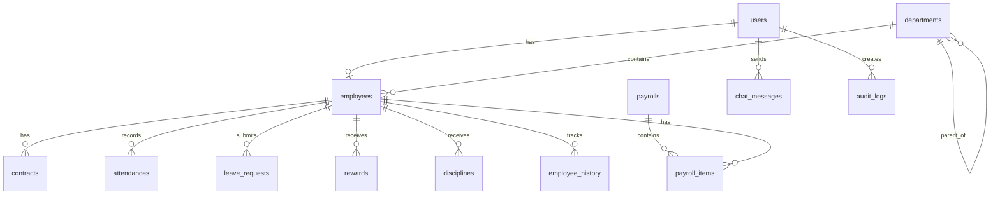

# ĐỀ XUẤT THIẾT KẾ DATABASE - HỆ THỐNG QUẢN LÝ NHÂN SỰ

## 📋 TỔNG QUAN

Thiết kế database cho hệ thống quản lý nhân sự với **13 bảng chính**, tuân thủ chuẩn **3NF (Third Normal Form)**, phù hợp cho đồ án tốt nghiệp:
- ✅ Đầy đủ chức năng (HR, Payroll, Attendance, Audit, AI Chatbot)
- ✅ Dễ hiểu và triển khai
- ✅ Tính toàn vẹn dữ liệu
- ✅ Audit trail hoàn chỉnh
- ✅ Có thể mở rộng sau này

---

## 🎯 NGUYÊN TẮC THIẾT KẾ

### 1. Naming Convention
- **Bảng**: `snake_case`, số nhiều (vd: `employees`, `departments`)
- **Cột**: `snake_case` (vd: `employee_code`, `full_name`)
- **Primary Key**: `id` (UUID)
- **Foreign Key**: `{table}_id` (vd: `department_id`, `employee_id`)
- **Timestamp**: `created_at`, `updated_at`, `deleted_at`

### 2. Data Types
- **ID**: `UUID` (tránh sequential ID leak)
- **Money**: `DECIMAL(12,2)` (chính xác cho tiền tệ)
- **Text**: `VARCHAR(n)` với giới hạn hợp lý
- **Date**: `DATE` cho ngày, `TIMESTAMP` cho thời điểm
- **Boolean**: `BOOLEAN` (không dùng 0/1)
- **JSON**: `JSONB` cho dữ liệu linh hoạt

### 3. Indexes Strategy
- Primary Key tự động có index
- Foreign Keys cần index
- Các cột thường xuyên WHERE/JOIN cần index
- Composite index cho queries phức tạp
- Partial index cho filtered queries

### 4. Constraints
- NOT NULL cho các trường bắt buộc
- UNIQUE cho các trường duy nhất
- CHECK constraints cho validation
- Foreign Key với ON DELETE/UPDATE rules

---

## 📊 THIẾT KẾ CÁC BẢNG

### 1. BẢNG `users` - Quản lý tài khoản đăng nhập

```sql
CREATE TABLE users (
    id UUID PRIMARY KEY DEFAULT gen_random_uuid(),
    email VARCHAR(255) NOT NULL UNIQUE,
    password_hash VARCHAR(255) NOT NULL,
    role VARCHAR(50) NOT NULL CHECK (role IN ('ADMIN', 'HR_MANAGER', 'MANAGER', 'EMPLOYEE')),
    employee_id UUID UNIQUE REFERENCES employees(id) ON DELETE SET NULL,
    is_active BOOLEAN DEFAULT true,
    created_at TIMESTAMP DEFAULT CURRENT_TIMESTAMP,
    updated_at TIMESTAMP DEFAULT CURRENT_TIMESTAMP
);

CREATE INDEX idx_users_email ON users(email);
CREATE INDEX idx_users_employee_id ON users(employee_id);
```

**Lý do thiết kế:**
- Tách `users` và `employees`: 1 nhân viên có thể không có tài khoản
- `password_hash`: Lưu hash, không lưu plaintext
- `is_active`: Soft delete, không xóa thật
- **Đơn giản hóa**: Bỏ failed_login_attempts, locked_until (có thể thêm sau)

---

### 2. BẢNG `departments` - Quản lý phòng ban

```sql
CREATE TABLE departments (
    id UUID PRIMARY KEY DEFAULT gen_random_uuid(),
    code VARCHAR(50) NOT NULL UNIQUE,
    name VARCHAR(255) NOT NULL,
    description TEXT,
    parent_id UUID REFERENCES departments(id) ON DELETE SET NULL,
    manager_id UUID REFERENCES employees(id) ON DELETE SET NULL,
    is_active BOOLEAN DEFAULT true,
    created_at TIMESTAMP DEFAULT CURRENT_TIMESTAMP,
    updated_at TIMESTAMP DEFAULT CURRENT_TIMESTAMP
);

CREATE INDEX idx_departments_code ON departments(code);
CREATE INDEX idx_departments_parent_id ON departments(parent_id);
CREATE INDEX idx_departments_manager_id ON departments(manager_id);
```

**Lý do thiết kế:**
- `parent_id`: Hỗ trợ cấu trúc phòng ban phân cấp (tree structure)
- `manager_id`: Trưởng phòng, có thể NULL nếu chưa gán
- `is_active`: Soft delete, giữ lịch sử

---

### 3. BẢNG `employees` - Quản lý nhân viên

```sql
CREATE TABLE employees (
    id UUID PRIMARY KEY DEFAULT gen_random_uuid(),
    employee_code VARCHAR(50) NOT NULL UNIQUE,
    full_name VARCHAR(255) NOT NULL,
    date_of_birth DATE NOT NULL,
    gender VARCHAR(20) CHECK (gender IN ('MALE', 'FEMALE', 'OTHER')),
    id_card VARCHAR(50) NOT NULL UNIQUE,
    address TEXT,
    phone VARCHAR(20),
    email VARCHAR(255) NOT NULL UNIQUE,
    avatar_url TEXT,
    
    department_id UUID NOT NULL REFERENCES departments(id) ON DELETE RESTRICT,
    position VARCHAR(100) NOT NULL,
    start_date DATE NOT NULL,
    end_date DATE,
    status VARCHAR(50) DEFAULT 'ACTIVE' CHECK (status IN ('ACTIVE', 'INACTIVE', 'ON_LEAVE')),
    
    base_salary DECIMAL(12,2) NOT NULL CHECK (base_salary >= 0),
    
    created_at TIMESTAMP DEFAULT CURRENT_TIMESTAMP,
    updated_at TIMESTAMP DEFAULT CURRENT_TIMESTAMP
);

CREATE INDEX idx_employees_code ON employees(employee_code);
CREATE INDEX idx_employees_department_id ON employees(department_id);
CREATE INDEX idx_employees_status ON employees(status);
```

**Lý do thiết kế:**
- `employee_code`: Mã nhân viên tự động sinh, UNIQUE
- `id_card`: CCCD/CMND, UNIQUE để tránh trùng
- `department_id`: NOT NULL, ON DELETE RESTRICT (không cho xóa phòng ban có nhân viên)
- `status`: Trạng thái làm việc
- **Đơn giản hóa**: Bỏ salary_coefficient, bỏ full-text search index

---

### 4. BẢNG `contracts` - Quản lý hợp đồng lao động

```sql
CREATE TABLE contracts (
    id UUID PRIMARY KEY DEFAULT gen_random_uuid(),
    employee_id UUID NOT NULL REFERENCES employees(id) ON DELETE CASCADE,
    contract_type VARCHAR(50) NOT NULL CHECK (contract_type IN ('PROBATION', 'FIXED_TERM', 'INDEFINITE')),
    contract_number VARCHAR(100) UNIQUE,
    start_date DATE NOT NULL,
    end_date DATE,
    salary DECIMAL(12,2) NOT NULL CHECK (salary >= 0),
    terms TEXT,
    file_url TEXT,
    status VARCHAR(50) DEFAULT 'ACTIVE' CHECK (status IN ('ACTIVE', 'EXPIRED', 'TERMINATED')),
    terminated_reason TEXT,
    created_at TIMESTAMP DEFAULT CURRENT_TIMESTAMP,
    updated_at TIMESTAMP DEFAULT CURRENT_TIMESTAMP,
    
    CONSTRAINT check_end_date CHECK (
        (contract_type = 'INDEFINITE' AND end_date IS NULL) OR
        (contract_type != 'INDEFINITE' AND end_date IS NOT NULL AND end_date > start_date)
    )
);

CREATE INDEX idx_contracts_employee_id ON contracts(employee_id);
CREATE INDEX idx_contracts_status ON contracts(status);
CREATE INDEX idx_contracts_end_date ON contracts(end_date) WHERE status = 'ACTIVE';
```

**Lý do thiết kế:**
- `contract_type`: 3 loại hợp đồng theo luật lao động VN
- `end_date`: NULL cho hợp đồng không thời hạn
- CHECK constraint: Đảm bảo logic nghiệp vụ
- Partial index trên `end_date` cho hợp đồng sắp hết hạn
- ON DELETE CASCADE: Xóa nhân viên thì xóa hợp đồng

---

### 5. BẢNG `attendances` - Quản lý chấm công

```sql
CREATE TABLE attendances (
    id UUID PRIMARY KEY DEFAULT gen_random_uuid(),
    employee_id UUID NOT NULL REFERENCES employees(id) ON DELETE CASCADE,
    date DATE NOT NULL,
    check_in TIMESTAMP,
    check_out TIMESTAMP,
    work_hours DECIMAL(5,2),
    is_late BOOLEAN DEFAULT false,
    is_early_leave BOOLEAN DEFAULT false,
    status VARCHAR(50) DEFAULT 'PRESENT' CHECK (status IN ('PRESENT', 'ABSENT', 'LEAVE', 'HOLIDAY')),
    notes TEXT,
    created_at TIMESTAMP DEFAULT CURRENT_TIMESTAMP,
    updated_at TIMESTAMP DEFAULT CURRENT_TIMESTAMP,
    
    CONSTRAINT unique_employee_date UNIQUE(employee_id, date),
    CONSTRAINT check_work_hours CHECK (work_hours >= 0 AND work_hours <= 24)
);

CREATE INDEX idx_attendances_employee_id ON attendances(employee_id);
CREATE INDEX idx_attendances_date ON attendances(date);
CREATE INDEX idx_attendances_employee_date ON attendances(employee_id, date);
```

**Lý do thiết kế:**
- UNIQUE constraint trên `(employee_id, date)`: 1 nhân viên chỉ 1 bản ghi/ngày
- `work_hours`: Tính tự động từ check_in/check_out
- `is_late`, `is_early_leave`: Đánh dấu vi phạm
- Composite index cho query theo nhân viên + tháng

---

### 6. BẢNG `leave_requests` - Quản lý đơn xin nghỉ

```sql
CREATE TABLE leave_requests (
    id UUID PRIMARY KEY DEFAULT gen_random_uuid(),
    employee_id UUID NOT NULL REFERENCES employees(id) ON DELETE CASCADE,
    leave_type VARCHAR(50) NOT NULL CHECK (leave_type IN ('ANNUAL', 'SICK', 'UNPAID', 'MATERNITY', 'PERSONAL')),
    start_date DATE NOT NULL,
    end_date DATE NOT NULL,
    total_days INT NOT NULL CHECK (total_days > 0),
    reason TEXT NOT NULL,
    status VARCHAR(50) DEFAULT 'PENDING' CHECK (status IN ('PENDING', 'APPROVED', 'REJECTED')),
    approver_id UUID REFERENCES users(id) ON DELETE SET NULL,
    approved_at TIMESTAMP,
    rejected_reason TEXT,
    created_at TIMESTAMP DEFAULT CURRENT_TIMESTAMP,
    updated_at TIMESTAMP DEFAULT CURRENT_TIMESTAMP,
    
    CONSTRAINT check_dates CHECK (end_date >= start_date)
);

CREATE INDEX idx_leave_requests_employee_id ON leave_requests(employee_id);
CREATE INDEX idx_leave_requests_status ON leave_requests(status);
CREATE INDEX idx_leave_requests_dates ON leave_requests(start_date, end_date);
```

**Lý do thiết kế:**
- `total_days`: Tính sẵn để dễ query
- `approver_id`: Người phê duyệt, có thể NULL nếu chưa duyệt
- `rejected_reason`: Lý do từ chối
- CHECK constraint: Đảm bảo end_date >= start_date

---

### 7. BẢNG `payrolls` - Quản lý bảng lương tháng

```sql
CREATE TABLE payrolls (
    id UUID PRIMARY KEY DEFAULT gen_random_uuid(),
    month INT NOT NULL CHECK (month BETWEEN 1 AND 12),
    year INT NOT NULL CHECK (year >= 2020),
    status VARCHAR(50) DEFAULT 'DRAFT' CHECK (status IN ('DRAFT', 'FINALIZED', 'PAID')),
    total_amount DECIMAL(15,2) NOT NULL DEFAULT 0,
    finalized_at TIMESTAMP,
    finalized_by UUID REFERENCES users(id) ON DELETE SET NULL,
    notes TEXT,
    created_at TIMESTAMP DEFAULT CURRENT_TIMESTAMP,
    updated_at TIMESTAMP DEFAULT CURRENT_TIMESTAMP,
    
    CONSTRAINT unique_month_year UNIQUE(month, year)
);

CREATE INDEX idx_payrolls_month_year ON payrolls(year, month);
CREATE INDEX idx_payrolls_status ON payrolls(status);
```

**Lý do thiết kế:**
- UNIQUE constraint trên `(month, year)`: 1 tháng chỉ 1 bảng lương
- `status`: DRAFT → FINALIZED → PAID
- `finalized_at` + `finalized_by`: Audit trail
- `total_amount`: Tổng quỹ lương tháng

---

### 8. BẢNG `payroll_items` - Chi tiết lương từng nhân viên

```sql
CREATE TABLE payroll_items (
    id UUID PRIMARY KEY DEFAULT gen_random_uuid(),
    payroll_id UUID NOT NULL REFERENCES payrolls(id) ON DELETE CASCADE,
    employee_id UUID NOT NULL REFERENCES employees(id) ON DELETE CASCADE,
    
    -- Lương cơ bản
    base_salary DECIMAL(12,2) NOT NULL,
    work_days INT NOT NULL,
    actual_work_days DECIMAL(5,2) NOT NULL,
    
    -- Phụ cấp
    allowances DECIMAL(12,2) DEFAULT 0,
    
    -- Thưởng phạt
    bonus DECIMAL(12,2) DEFAULT 0,
    deduction DECIMAL(12,2) DEFAULT 0,
    
    -- Làm thêm giờ
    overtime_hours DECIMAL(5,2) DEFAULT 0,
    overtime_pay DECIMAL(12,2) DEFAULT 0,
    
    -- Bảo hiểm (8% + 1.5% + 1%)
    insurance DECIMAL(12,2) DEFAULT 0,
    
    -- Thuế TNCN
    tax DECIMAL(12,2) DEFAULT 0,
    
    -- Tổng
    net_salary DECIMAL(12,2) NOT NULL,
    
    notes TEXT,
    created_at TIMESTAMP DEFAULT CURRENT_TIMESTAMP,
    updated_at TIMESTAMP DEFAULT CURRENT_TIMESTAMP,
    
    CONSTRAINT unique_payroll_employee UNIQUE(payroll_id, employee_id)
);

CREATE INDEX idx_payroll_items_payroll_id ON payroll_items(payroll_id);
CREATE INDEX idx_payroll_items_employee_id ON payroll_items(employee_id);
```

**Lý do thiết kế:**
- UNIQUE constraint: 1 nhân viên chỉ 1 dòng trong 1 bảng lương
- **Đơn giản hóa**: Gộp các loại bảo hiểm thành 1 cột `insurance`
- **Đơn giản hóa**: Gộp rewards/disciplines thành bonus/deduction
- **Đơn giản hóa**: Bỏ JSONB allowances, dùng số đơn giản
- Công thức: `net_salary = base_salary * (actual_work_days/work_days) + allowances + bonus - deduction + overtime_pay - insurance - tax`

---

### 9. BẢNG `rewards` - Quản lý khen thưởng

```sql
CREATE TABLE rewards (
    id UUID PRIMARY KEY DEFAULT gen_random_uuid(),
    employee_id UUID NOT NULL REFERENCES employees(id) ON DELETE CASCADE,
    reason TEXT NOT NULL,
    amount DECIMAL(12,2) NOT NULL CHECK (amount >= 0),
    reward_date DATE NOT NULL,
    reward_type VARCHAR(50) CHECK (reward_type IN ('BONUS', 'ACHIEVEMENT', 'PERFORMANCE', 'OTHER')),
    created_by UUID NOT NULL REFERENCES users(id) ON DELETE SET NULL,
    created_at TIMESTAMP DEFAULT CURRENT_TIMESTAMP,
    updated_at TIMESTAMP DEFAULT CURRENT_TIMESTAMP
);

CREATE INDEX idx_rewards_employee_id ON rewards(employee_id);
CREATE INDEX idx_rewards_reward_date ON rewards(reward_date);
```

---

### 10. BẢNG `disciplines` - Quản lý kỷ luật

```sql
CREATE TABLE disciplines (
    id UUID PRIMARY KEY DEFAULT gen_random_uuid(),
    employee_id UUID NOT NULL REFERENCES employees(id) ON DELETE CASCADE,
    reason TEXT NOT NULL,
    discipline_type VARCHAR(50) NOT NULL CHECK (discipline_type IN ('WARNING', 'FINE', 'SUSPENSION', 'TERMINATION')),
    amount DECIMAL(12,2) DEFAULT 0 CHECK (amount >= 0),
    discipline_date DATE NOT NULL,
    created_by UUID NOT NULL REFERENCES users(id) ON DELETE SET NULL,
    created_at TIMESTAMP DEFAULT CURRENT_TIMESTAMP,
    updated_at TIMESTAMP DEFAULT CURRENT_TIMESTAMP
);

CREATE INDEX idx_disciplines_employee_id ON disciplines(employee_id);
CREATE INDEX idx_disciplines_discipline_date ON disciplines(discipline_date);
```

---

### 11. BẢNG `employee_history` - Lịch sử thay đổi (Audit Trail)

```sql
CREATE TABLE employee_history (
    id UUID PRIMARY KEY DEFAULT gen_random_uuid(),
    employee_id UUID NOT NULL REFERENCES employees(id) ON DELETE CASCADE,
    field VARCHAR(100) NOT NULL,
    old_value TEXT,
    new_value TEXT,
    changed_by UUID NOT NULL REFERENCES users(id) ON DELETE SET NULL,
    changed_at TIMESTAMP DEFAULT CURRENT_TIMESTAMP
);

CREATE INDEX idx_employee_history_employee_id ON employee_history(employee_id);
CREATE INDEX idx_employee_history_changed_at ON employee_history(changed_at);
```

**Lý do thiết kế:**
- Audit trail đầy đủ cho mọi thay đổi thông tin nhân viên
- `field`: Tên trường thay đổi (vd: "position", "salary")
- `old_value` + `new_value`: Giá trị trước và sau
- `changed_by`: Người thực hiện thay đổi

---

### 12. BẢNG `chat_messages` - Lịch sử chat với AI Chatbot

```sql
CREATE TABLE chat_messages (
    id UUID PRIMARY KEY DEFAULT gen_random_uuid(),
    conversation_id UUID NOT NULL,
    user_id UUID NOT NULL REFERENCES users(id) ON DELETE CASCADE,
    message TEXT NOT NULL,
    response TEXT,
    context JSONB,
    created_at TIMESTAMP DEFAULT CURRENT_TIMESTAMP
);

CREATE INDEX idx_chat_messages_conversation_id ON chat_messages(conversation_id);
CREATE INDEX idx_chat_messages_user_id ON chat_messages(user_id);
CREATE INDEX idx_chat_messages_created_at ON chat_messages(created_at);
```

**Lý do thiết kế:**
- Lưu lịch sử hội thoại với AI chatbot
- `conversation_id`: Nhóm các tin nhắn trong 1 cuộc hội thoại
- `context`: JSONB lưu thông tin ngữ cảnh (employee_id, role, etc.)
- Hỗ trợ cải thiện chatbot qua thời gian

---

### 13. BẢNG `audit_logs` - Log hệ thống

```sql
CREATE TABLE audit_logs (
    id UUID PRIMARY KEY DEFAULT gen_random_uuid(),
    user_id UUID REFERENCES users(id) ON DELETE SET NULL,
    action VARCHAR(100) NOT NULL,
    resource_type VARCHAR(100) NOT NULL,
    resource_id UUID,
    old_data JSONB,
    new_data JSONB,
    ip_address INET,
    user_agent TEXT,
    created_at TIMESTAMP DEFAULT CURRENT_TIMESTAMP
);

CREATE INDEX idx_audit_logs_user_id ON audit_logs(user_id);
CREATE INDEX idx_audit_logs_resource ON audit_logs(resource_type, resource_id);
CREATE INDEX idx_audit_logs_created_at ON audit_logs(created_at);
CREATE INDEX idx_audit_logs_action ON audit_logs(action);
```

**Lý do thiết kế:**
- Log mọi hành động quan trọng trong hệ thống
- `action`: CREATE, UPDATE, DELETE, LOGIN, LOGOUT, etc.
- `resource_type` + `resource_id`: Tài nguyên bị tác động
- `old_data` + `new_data`: JSONB lưu toàn bộ object trước/sau
- `ip_address` + `user_agent`: Thông tin security
- Hỗ trợ forensics và compliance

---

## 🔗 QUAN HỆ GIỮA CÁC BẢNG

```
users (1) ----< (N) employees
departments (1) ----< (N) employees
departments (1) ----< (N) departments (self-reference)
employees (1) ----< (N) contracts
employees (1) ----< (N) attendances
employees (1) ----< (N) leave_requests
employees (1) ----< (N) payroll_items
employees (1) ----< (N) rewards
employees (1) ----< (N) disciplines
employees (1) ----< (N) employee_history
payrolls (1) ----< (N) payroll_items
users (1) ----< (N) chat_messages
users (1) ----< (N) audit_logs
```

---

## 🎨 ERD DIAGRAM (Mermaid)



---

## ⚡ OPTIMIZATION STRATEGIES (Tùy chọn - có thể bỏ qua cho đồ án)

### 1. Materialized Views cho Reports
```sql
CREATE MATERIALIZED VIEW mv_employee_stats AS
SELECT 
    d.id as department_id,
    d.name as department_name,
    COUNT(e.id) as total_employees,
    COUNT(CASE WHEN e.status = 'ACTIVE' THEN 1 END) as active_employees,
    AVG(e.base_salary) as avg_salary
FROM departments d
LEFT JOIN employees e ON d.id = e.department_id
GROUP BY d.id, d.name;

CREATE UNIQUE INDEX ON mv_employee_stats(department_id);
```

### 2. Composite Indexes (Nếu cần tối ưu performance)
```sql
-- Query: Tìm nhân viên theo phòng ban và trạng thái
CREATE INDEX idx_employees_dept_status ON employees(department_id, status);

-- Query: Chấm công theo nhân viên và tháng
CREATE INDEX idx_attendances_emp_month ON attendances(employee_id, date DESC);
```

---

## ✅ VALIDATION RULES

### Business Logic Constraints
```sql
-- Không cho phép lương âm
ALTER TABLE employees ADD CONSTRAINT check_positive_salary 
CHECK (base_salary >= 0);

-- Ngày kết thúc hợp đồng phải sau ngày bắt đầu
ALTER TABLE contracts ADD CONSTRAINT check_contract_dates
CHECK (end_date IS NULL OR end_date > start_date);

-- Số giờ làm việc không quá 24h/ngày
ALTER TABLE attendances ADD CONSTRAINT check_work_hours
CHECK (work_hours >= 0 AND work_hours <= 24);

-- Tháng từ 1-12
ALTER TABLE payrolls ADD CONSTRAINT check_month
CHECK (month BETWEEN 1 AND 12);
```

---

## 🧪 SAMPLE DATA SEED

```sql
-- Insert sample departments
INSERT INTO departments (code, name) VALUES
('IT', 'Phòng Công Nghệ Thông Tin'),
('HR', 'Phòng Nhân Sự'),
('ACC', 'Phòng Kế Toán');

-- Insert sample employees
INSERT INTO employees (employee_code, full_name, email, department_id, position, start_date, base_salary)
VALUES 
('EMP001', 'Nguyễn Văn A', 'nva@company.com', (SELECT id FROM departments WHERE code='IT'), 'Developer', '2024-01-01', 15000000),
('EMP002', 'Trần Thị B', 'ttb@company.com', (SELECT id FROM departments WHERE code='HR'), 'HR Manager', '2024-01-01', 20000000);
```

---

## 📝 MIGRATION STRATEGY

### Phase 1: Core Tables
1. users
2. departments
3. employees

### Phase 2: HR Operations
4. contracts
5. attendances
6. leave_requests

### Phase 3: Payroll
7. payrolls
8. payroll_items
9. rewards
10. disciplines


---

## 🎯 KẾT LUẬN

### ✅ Ưu điểm của thiết kế này:

1. **Đơn giản, dễ hiểu**: Phù hợp với đồ án tốt nghiệp
2. **Đầy đủ chức năng**: Đáp ứng yêu cầu quản lý nhân sự cơ bản
3. **Chuẩn hóa tốt (3NF)**: Giảm redundancy, dễ maintain
4. **Data Integrity**: CHECK constraints, Foreign Keys
5. **Có thể mở rộng**: Dễ dàng thêm tính năng sau này
6. **Performance**: Indexes cơ bản cho các query thường dùng

### 🔄 Khả năng mở rộng trong tương lai:

- Thêm bảng `employee_history` (audit trail chi tiết)
- Thêm bảng `chat_messages` (chatbot AI)
- Thêm bảng `audit_logs` (system logs)
- Thêm bảng `performance_reviews` (đánh giá hiệu suất)
- Thêm bảng `training_programs` (đào tạo)
- Thêm bảng `recruitment` (tuyển dụng)

---

## 📚 REFERENCES

- [PostgreSQL Best Practices](https://www.postgresql.org/docs/current/index.html)
- [Database Normalization](https://en.wikipedia.org/wiki/Database_normalization)
- [HR Database Design Patterns](https://www.geeksforgeeks.org/sql/how-to-design-a-database-for-human-resource-management-system-hrms/)
- [Payroll System ERD](https://www.acciyo.com/payroll-entity-relationship-diagram-the-ultimate-blueprint-for-an-accurate-payroll-database/)

---

**Tạo bởi:** Kiro AI Assistant  
**Ngày:** 15/01/2026  
**Version:** 2.1 (Final - Đầy đủ cho đồ án)

---

## 📝 THAY ĐỔI SO VỚI VERSION 1.0

**Đã đơn giản hóa (giữ đủ chức năng):**
- ✅ Bảng `users`: Bỏ failed_login_attempts, locked_until (có thể thêm sau)
- ✅ Bảng `employees`: Bỏ salary_coefficient, full-text search (dùng LIKE)
- ✅ Bảng `payroll_items`: Gộp bảo hiểm, gộp thưởng/phạt

**Đã giữ lại (quan trọng):**
- ✅ Bảng `employee_history` - Audit trail chi tiết
- ✅ Bảng `chat_messages` - AI Chatbot
- ✅ Bảng `audit_logs` - System logs

**Kết quả:**
- 🎯 **13 bảng đầy đủ** cho hệ thống HRM hoàn chỉnh
- 🎯 Đơn giản hóa ở mức vừa phải, không mất tính năng
- 🎯 Phù hợp với đồ án tốt nghiệp
- 🎯 Có audit trail và AI chatbot (điểm cộng)
